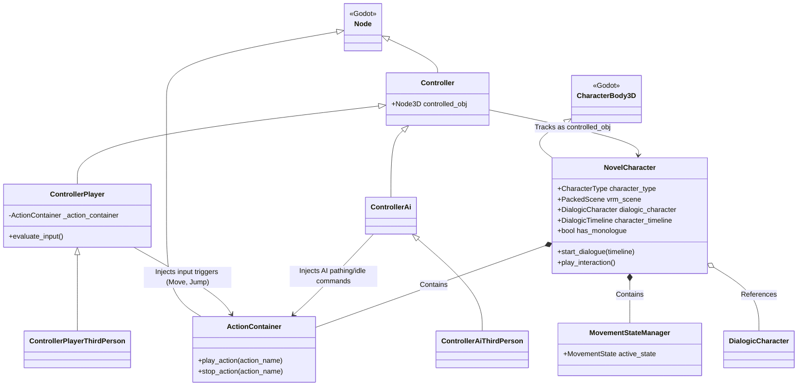

# Character Setup and Architecture

This document breaks down the class relationships powering the characters in the **VRM-NovelEngine** and provides a step-by-step walkthrough on how to create and configure new characters (both Player and NPC).

## 1. Class Relationship Diagram

The character logic is heavily decoupled. `NovelCharacter` handles the state, animation, and Dialogic integration, while separate `Controller` nodes inject movement commands (Player Input vs AI) into an `ActionContainer`.

### Key Takeaways:
- **`NovelCharacter`**: The visual and physical representation of the character. It instantiates the 3D VRM model dynamically and handles Dialogic event subscriptions (like cutscenes and looking at the camera).
- **`ActionContainer`**: A generic input receiver. It holds `Action` nodes like `Move` and `Jump`.
- **`ControllerPlayer` / `ControllerAi`**: These scripts do *not* live inside the character scene. They are placed in the level/scenario and assigned a `controlled_obj`. This allows you to possess an NPC or detach the player easily.

---

## 2. Character Setup Procedure

Setting up a character involves two phases: formatting the 3D VRM model, and wrapping it in the engine's `NovelCharacter` template.

### Phase 1: Preparing the VRM Model
*This ensures Godot's animation system can drive the model's skeleton.*

1. **Import the `.vrm` file**: Drag and drop your `.vrm` VTuber model into the project (e.g., in `samples/`).
2. **Retarget the Skeleton**:
   - Double-click the `.vrm` file to open the *Advanced Import Settings*.
   - Select the `GeneralSkeleton` node.
   - On the right panel under *Retarget*, assign a `HumanoidBoneMap`.
   - Click **Reimport**.
3. **Create the Model Scene**:
   - Right-click the `.vrm` file and select **New Inherited Scene**.
   - Select the `AnimationPlayer` node.
   - Open the **Animation panel** at the bottom, click **Animation** -> **Manage Animations...**
   - Load the engine's default animation libraries (e.g., `res://visual-novel/animations`).
   - *(Optional)* Check the `UpdateOnEditor` box to preview secondary physics (hair, clothes).
4. **Save**: Save this scene as a `.scn` file (e.g., `dorita_corona.scn`).

### Phase 2: Configuring the NovelCharacter
*This binds your prepped model to the game logic and Dialogic.*

1. **Inherit the Base Template**:
   - Right-click `res://visual-novel/characters/novel_character_base.tscn` and choose **New Inherited Scene**.
   - Rename the root node to your character's name.
2. **Assign the Model**:
   - Select the root node (the `NovelCharacter` script).
   - In the Inspector, locate the **VRM** category.
   - Drag and drop your `.scn` file from Phase 1 into the `Vrm Scene` property.
   - *The script will automatically instantiate the model into the `ModelContainer` and link the `AnimationPlayer`.*
3. **Configure Dialogic**:
   - Under the **Dialogic** category in the Inspector, assign the `Dialogic Character` (`.dch` file).
   - If this character is an NPC, assign the `Character Timeline` (`.dtl`) that should play when the player interacts with them.
4. **Set the Character Type**:
   - Set `Character Type` to `PLAYER` if this is the avatar the user controls, or `NPC` for interactive characters. 
   - *Note: NPCs automatically hide camera logic to save processing.*
5. **Adjust Collisions & Interaction Areas**:
   - The script attempts to auto-calculate height, but you can manually tweak the `CollisionShape3D` and the `InteractionArea3D` placement to fit the model's bounding box perfectly.
6. **Save**: Save your new character in `visual-novel/characters/`.

### Phase 3: Placing in the World

1. **Drop into the Scenario**: Drag your saved character into your level (e.g., `Metro.tscn`).
2. **Attach a Controller**:
   - Add a `Node` to your scene and attach `controller_player_third_person.gd` (for the player) or `controller_ai_third_person.gd` (for NPCs).
   - In the Controller's Inspector, set `Controlled Obj` to point to your character node.
