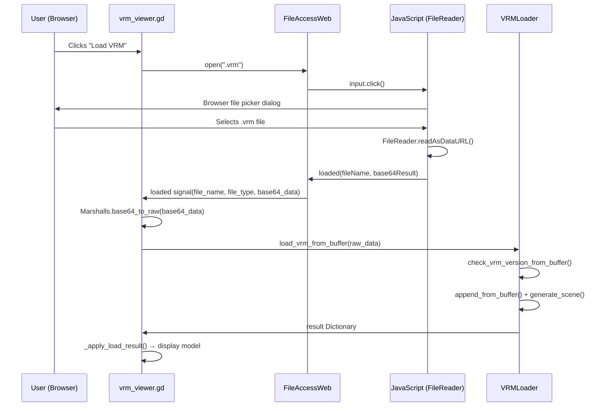

# FileAccessWeb Plugin Integration — Walkthrough

## Summary

Integrated the [Scrawach/godot-file-access-web](https://github.com/Scrawach/godot-file-access-web) plugin to enable VRM file loading on web exports. The plugin was manually installed by the user; the code changes add buffer-based VRM loading and wire up the web file picker.

## Changes Made

### 1. [vrm_loader.gd](file:///home/jaime/Developer/Godot/vrm-novelengine/vrm-loader/vrm_loader.gd) — Buffer-based loading

```diff:vrm_loader.gd
class_name VRMLoader
extends RefCounted

## Utility class to handle runtime loading of VRM models.
## Relies on the V-Sekai godot-vrm plugin's GLTFDocumentExtension.

const VRM0_EXTENSIONS: Array[String] = [
	"res://addons/vrm/vrm_extension.gd"
]

const VRM1_EXTENSIONS: Array[String] = [
	"res://addons/vrm/1.0/VRMC_materials_mtoon.gd",
	"res://addons/vrm/1.0/VRMC_materials_hdr_emissiveMultiplier.gd",
	"res://addons/vrm/1.0/VRMC_springBone.gd",
	"res://addons/vrm/1.0/VRMC_node_constraint.gd",
	"res://addons/vrm/1.0/VRMC_vrm.gd"
]

## Inspects the binary GLTF (GLB) file structure to quickly determine
## if it uses VRM 0.0 or VRM 1.0 extensions in its JSON chunk.
## Returns 0 for VRM 0.0, 1 for VRM 1.0, and -1 if unknown/invalid.
static func check_vrm_version(absolute_file_path: String) -> int:
	var file := FileAccess.open(absolute_file_path, FileAccess.READ)
	if not file:
		return -1
	
	# Check GLB Magic "glTF"
	var magic := file.get_buffer(4).get_string_from_ascii()
	if magic != "glTF":
		return -1
		
	var _version := file.get_32()
	var _length := file.get_32()
	
	var chunk_length := file.get_32()
	var chunk_type := file.get_buffer(4).get_string_from_ascii()
	if chunk_type != "JSON":
		return -1
		
	var json_data := file.get_buffer(chunk_length).get_string_from_utf8()
	
	if "\"VRMC_vrm\"" in json_data:
		return 1
	elif "\"VRM\"" in json_data:
		return 0
		
	return -1

## Loads a .vrm file from the file system at runtime.
## Returns a Dictionary with the following structure:
## { "success": bool, "error_msg": String, "node": Node3D (or null) }
static func load_vrm(absolute_file_path: String, force_version: int = 0) -> Dictionary:
	var result: Dictionary[Variant, Variant] = {
		"success": false,
		"error_msg": "",
		"node": null
	}
	
	if not FileAccess.file_exists(absolute_file_path):
		result["error_msg"] = "File does not exist at path: " + absolute_file_path
		return result

	var vrm_version := check_vrm_version(absolute_file_path)
	if force_version == 1:
		vrm_version = 0
	elif force_version == 2:
		vrm_version = 1
		
	print("VRM Version: ", vrm_version)
	if vrm_version == -1:
		result["error_msg"] = "File is not a valid VRM or GLB file: " + absolute_file_path
		return result

	var gltf: GLTFDocument = GLTFDocument.new()
	var state: GLTFState = GLTFState.new()
	
	# Load and register the correct extensions based on VRM version
	var extensions_to_register: Array[String] = VRM1_EXTENSIONS if vrm_version == 1 else VRM0_EXTENSIONS
	var registered_extensions: Array[GLTFDocumentExtension] = []
	
	for ext_path in extensions_to_register:
		var ext_instance: GLTFDocumentExtension = load(ext_path).new()
		GLTFDocument.register_gltf_document_extension(ext_instance, true)
		registered_extensions.append(ext_instance)
	
	# Keep images in memory for runtime instead of extracting to disk
	state.handle_binary_image = GLTFState.HANDLE_BINARY_EMBED_AS_UNCOMPRESSED
	
	state.set_additional_data(&"vrm/head_hiding_method", 0)
	state.set_additional_data(&"vrm/first_person_layers", 2)
	state.set_additional_data(&"vrm/third_person_layers", 4)
#	state.set_additional_data(&"vrm/already_processed", false)
	
	# Parse the file
	var err: int = gltf.append_from_file(absolute_file_path, state)
	if err != OK:
		result["error_msg"] = "Failed to parse GLTF/VRM file. Error code: " + str(err)
		for ext in registered_extensions:
			GLTFDocument.unregister_gltf_document_extension(ext)
		return result
		
	# Generate the node tree
	var vrm_node: Node3D = gltf.generate_scene(state)
	
	# Cleanup registration
	for ext in registered_extensions:
		GLTFDocument.unregister_gltf_document_extension(ext)
	
	if not vrm_node:
		result["error_msg"] = "Failed to generate scene from parsed data."
		return result
	
	# Godot's GLTF importer natively imports models facing backwards (Z+).
	# For convenience, we rotate it to face forwards (Z-).
	vrm_node.rotation.y = PI
	
	result["success"] = true
	result["node"] = vrm_node
	return result
===
class_name VRMLoader
extends RefCounted

## Utility class to handle runtime loading of VRM models.
## Relies on the V-Sekai godot-vrm plugin's GLTFDocumentExtension.

const VRM0_EXTENSIONS: Array[String] = [
	"res://addons/vrm/vrm_extension.gd"
]

const VRM1_EXTENSIONS: Array[String] = [
	"res://addons/vrm/1.0/VRMC_materials_mtoon.gd",
	"res://addons/vrm/1.0/VRMC_materials_hdr_emissiveMultiplier.gd",
	"res://addons/vrm/1.0/VRMC_springBone.gd",
	"res://addons/vrm/1.0/VRMC_node_constraint.gd",
	"res://addons/vrm/1.0/VRMC_vrm.gd"
]

## Inspects the binary GLTF (GLB) file structure to quickly determine
## if it uses VRM 0.0 or VRM 1.0 extensions in its JSON chunk.
## Returns 0 for VRM 0.0, 1 for VRM 1.0, and -1 if unknown/invalid.
static func check_vrm_version(absolute_file_path: String) -> int:
	var file := FileAccess.open(absolute_file_path, FileAccess.READ)
	if not file:
		return -1
	
	# Check GLB Magic "glTF"
	var magic := file.get_buffer(4).get_string_from_ascii()
	if magic != "glTF":
		return -1
		
	var _version := file.get_32()
	var _length := file.get_32()
	
	var chunk_length := file.get_32()
	var chunk_type := file.get_buffer(4).get_string_from_ascii()
	if chunk_type != "JSON":
		return -1
		
	var json_data := file.get_buffer(chunk_length).get_string_from_utf8()
	
	if "\"VRMC_vrm\"" in json_data:
		return 1
	elif "\"VRM\"" in json_data:
		return 0
		
	return -1

## Inspects raw GLB bytes to determine VRM version without needing a file on disk.
## Returns 0 for VRM 0.0, 1 for VRM 1.0, and -1 if unknown/invalid.
static func check_vrm_version_from_buffer(data: PackedByteArray) -> int:
	if data.size() < 20: # Minimum: 12-byte header + 8-byte chunk header
		return -1
	
	# Check GLB Magic "glTF"
	var magic := data.slice(0, 4).get_string_from_ascii()
	if magic != "glTF":
		return -1
	
	# Skip version (4 bytes) and length (4 bytes)
	# Read chunk_length at offset 12 (little-endian u32)
	var chunk_length: int = data.decode_u32(12)
	
	# Check chunk type at offset 16
	var chunk_type := data.slice(16, 20).get_string_from_ascii()
	if chunk_type != "JSON":
		return -1
	
	if data.size() < 20 + chunk_length:
		return -1
	
	var json_data := data.slice(20, 20 + chunk_length).get_string_from_utf8()
	
	if "\"VRMC_vrm\"" in json_data:
		return 1
	elif "\"VRM\"" in json_data:
		return 0
	
	return -1

## Loads a .vrm file from the file system at runtime.
## Returns a Dictionary with the following structure:
## { "success": bool, "error_msg": String, "node": Node3D (or null) }
static func load_vrm(absolute_file_path: String, force_version: int = 0) -> Dictionary:
	var result: Dictionary[Variant, Variant] = {
		"success": false,
		"error_msg": "",
		"node": null
	}
	
	if not FileAccess.file_exists(absolute_file_path):
		result["error_msg"] = "File does not exist at path: " + absolute_file_path
		return result

	var vrm_version := check_vrm_version(absolute_file_path)
	if force_version == 1:
		vrm_version = 0
	elif force_version == 2:
		vrm_version = 1
		
	print("VRM Version: ", vrm_version)
	if vrm_version == -1:
		result["error_msg"] = "File is not a valid VRM or GLB file: " + absolute_file_path
		return result

	var gltf: GLTFDocument = GLTFDocument.new()
	var state: GLTFState = GLTFState.new()
	var registered_extensions := _register_vrm_extensions(vrm_version)
	_configure_gltf_state(state)
	
	# Parse the file
	var err: int = gltf.append_from_file(absolute_file_path, state)
	if err != OK:
		result["error_msg"] = "Failed to parse GLTF/VRM file. Error code: " + str(err)
		_unregister_extensions(registered_extensions)
		return result
	
	return _generate_vrm_scene(gltf, state, registered_extensions)

## Loads a VRM from raw bytes (for web uploads via FileAccessWeb).
## Returns a Dictionary with the same structure as load_vrm().
static func load_vrm_from_buffer(data: PackedByteArray, force_version: int = 0) -> Dictionary:
	var result: Dictionary[Variant, Variant] = {
		"success": false,
		"error_msg": "",
		"node": null
	}
	
	if data.is_empty():
		result["error_msg"] = "Empty data buffer provided."
		return result
	
	var vrm_version := check_vrm_version_from_buffer(data)
	if force_version == 1:
		vrm_version = 0
	elif force_version == 2:
		vrm_version = 1
	
	print("VRM Version (from buffer): ", vrm_version)
	if vrm_version == -1:
		result["error_msg"] = "Buffer is not a valid VRM or GLB file."
		return result
	
	var gltf: GLTFDocument = GLTFDocument.new()
	var state: GLTFState = GLTFState.new()
	var registered_extensions := _register_vrm_extensions(vrm_version)
	_configure_gltf_state(state)
	
	# Parse from buffer — base_path is empty since the data is self-contained
	var err: int = gltf.append_from_buffer(data, "", state)
	if err != OK:
		result["error_msg"] = "Failed to parse GLTF/VRM buffer. Error code: " + str(err)
		_unregister_extensions(registered_extensions)
		return result
	
	return _generate_vrm_scene(gltf, state, registered_extensions)

# ---------- Private helpers ----------

## Registers the appropriate VRM GLTF extensions and returns the list for later cleanup.
static func _register_vrm_extensions(vrm_version: int) -> Array[GLTFDocumentExtension]:
	var extensions_to_register: Array[String] = VRM1_EXTENSIONS if vrm_version == 1 else VRM0_EXTENSIONS
	var registered_extensions: Array[GLTFDocumentExtension] = []
	
	for ext_path in extensions_to_register:
		var ext_instance: GLTFDocumentExtension = load(ext_path).new()
		GLTFDocument.register_gltf_document_extension(ext_instance, true)
		registered_extensions.append(ext_instance)
	
	return registered_extensions

## Configures the GLTFState with VRM-specific settings.
static func _configure_gltf_state(state: GLTFState) -> void:
	# Keep images in memory for runtime instead of extracting to disk
	state.handle_binary_image = GLTFState.HANDLE_BINARY_EMBED_AS_UNCOMPRESSED
	
	state.set_additional_data(&"vrm/head_hiding_method", 0)
	state.set_additional_data(&"vrm/first_person_layers", 2)
	state.set_additional_data(&"vrm/third_person_layers", 4)
#	state.set_additional_data(&"vrm/already_processed", false)

## Unregisters previously registered GLTF extensions.
static func _unregister_extensions(extensions: Array[GLTFDocumentExtension]) -> void:
	for ext in extensions:
		GLTFDocument.unregister_gltf_document_extension(ext)

## Generates the final VRM scene from a parsed GLTFDocument + GLTFState.
static func _generate_vrm_scene(gltf: GLTFDocument, state: GLTFState, registered_extensions: Array[GLTFDocumentExtension]) -> Dictionary:
	var result: Dictionary[Variant, Variant] = {
		"success": false,
		"error_msg": "",
		"node": null
	}
	
	# Generate the node tree
	var vrm_node: Node3D = gltf.generate_scene(state)
	
	# Cleanup registration
	_unregister_extensions(registered_extensions)
	
	if not vrm_node:
		result["error_msg"] = "Failed to generate scene from parsed data."
		return result
	
	# Godot's GLTF importer natively imports models facing backwards (Z+).
	# For convenience, we rotate it to face forwards (Z-).
	vrm_node.rotation.y = PI
	
	result["success"] = true
	result["node"] = vrm_node
	return result
```

**What changed:**
- Added `check_vrm_version_from_buffer(data: PackedByteArray)` — reads the GLB binary header directly from a byte array to detect VRM 0.0 vs 1.0
- Added `load_vrm_from_buffer(data: PackedByteArray, force_version)` — uses `GLTFDocument.append_from_buffer()` instead of `append_from_file()`
- Extracted shared logic into private helpers to avoid duplication:
  - `_register_vrm_extensions()` — registers VRM GLTF extensions
  - `_configure_gltf_state()` — sets VRM-specific GLTFState properties
  - `_unregister_extensions()` — cleanup
  - `_generate_vrm_scene()` — shared scene generation + rotation

---

### 2. [vrm_viewer.gd](file:///home/jaime/Developer/Godot/vrm-novelengine/samples/vrm_viewer/scripts/vrm_viewer.gd) — Web-conditional loading

```diff:vrm_viewer.gd
extends Node3D

@onready var load_button: Button = $UI/Control/LibraryButton
@onready var message_label: Label = $UI/Control/MessageLabel
@onready var file_dialog: FileDialog = $UI/FileDialog
@onready var model_pivot: Node3D = $ModelPivot

@onready var meta_panel: VBoxContainer = $UI/Control/MetaPanel
@onready var version_option: OptionButton = $UI/Control/VersionOption
@onready var home_button: Button = $UI/Control/HomeButton
@onready var camera_pivot: Node3D = $CameraPivot

var current_model: Node3D = null

func _ready() -> void:
	load_button.pressed.connect(_on_load_button_pressed)
	file_dialog.file_selected.connect(_on_file_selected)
	home_button.pressed.connect(_on_home_button_pressed)
	
	# Support for drag and drop files (especially useful for web exports)
	get_viewport().files_dropped.connect(_on_files_dropped)
	
	message_label.text = ""
	meta_panel.hide()
	
	# Wire up dependencies
	camera_pivot.target_model_pivot = model_pivot
	
	# Load default model
	_on_file_selected("res://samples/character_samples/vrm/Brayan.vrm")

func _on_home_button_pressed() -> void:
	if camera_pivot.has_method("reset_camera"):
		camera_pivot.reset_camera()

func _on_load_button_pressed() -> void:
	message_label.text = ""
	file_dialog.popup_centered()

func _on_files_dropped(files: PackedStringArray) -> void:
	if files.size() > 0:
		var file_path = files[0]
		var ext = file_path.get_extension().to_lower()
		if ext == "vrm" or ext == "vrma":
			_on_file_selected(file_path)
		else:
			message_label.add_theme_color_override("font_color", Color(1.0, 0.3, 0.3))
			message_label.text = "Error: Please drop a valid .vrm file."


func _on_file_selected(path: String) -> void:
	if current_model:
		current_model.queue_free()
		current_model = null
		meta_panel.hide()
	
	message_label.add_theme_color_override("font_color", Color.WHITE)
	message_label.text = "Loading... Please wait."
	
	await get_tree().process_frame
	
	var force_version: int = version_option.get_selected_id()
	var result: Dictionary = VRMLoader.load_vrm(path, force_version)
	
	if result["success"]:
		var ps: PackedScene = PackedScene.new()
		ps.pack(result["node"])
		current_model = ps.instantiate()
		
		model_pivot.add_child(current_model)
		
		if camera_pivot.has_method("reset_camera"):
			camera_pivot.reset_camera()
		else:
			model_pivot.rotation.y = PI # Fallback
		
		message_label.add_theme_color_override("font_color", Color(0.3, 1.0, 0.3))
		message_label.text = "Loaded successfully!"
		
		_display_metadata(current_model)
			
	else:
		message_label.add_theme_color_override("font_color", Color(1.0, 0.3, 0.3))
		message_label.text = "Error: " + result["error_msg"]

func _display_metadata(model: Node3D) -> void:
	var vrm_meta = model.get("vrm_meta")
	
	if vrm_meta == null or not (vrm_meta is Resource):
		print("[VRMViewer] vrm_meta unavailable for this model")
		meta_panel.hide()
		return
	
	meta_panel.show()
	
	if meta_panel.has_method("display_metadata"):
		meta_panel.display_metadata(vrm_meta)
===
extends Node3D

@onready var load_button: Button = $UI/Control/LibraryButton
@onready var message_label: Label = $UI/Control/MessageLabel
@onready var file_dialog: FileDialog = $UI/FileDialog
@onready var model_pivot: Node3D = $ModelPivot

@onready var meta_panel: VBoxContainer = $UI/Control/MetaPanel
@onready var version_option: OptionButton = $UI/Control/VersionOption
@onready var home_button: Button = $UI/Control/HomeButton
@onready var camera_pivot: Node3D = $CameraPivot

var current_model: Node3D = null
var _is_web: bool = false
var _file_access_web: RefCounted = null  # FileAccessWeb (only on web builds)

func _ready() -> void:
	_is_web = OS.get_name() == "Web"
	
	load_button.pressed.connect(_on_load_button_pressed)
	home_button.pressed.connect(_on_home_button_pressed)
	
	if _is_web:
		# Use FileAccessWeb plugin for browser file picker
		_file_access_web = FileAccessWeb.new()
		_file_access_web.loaded.connect(_on_web_file_loaded)
		_file_access_web.error.connect(_on_web_file_error)
		_file_access_web.upload_cancelled.connect(_on_web_upload_cancelled)
	else:
		# Use native FileDialog on desktop
		file_dialog.file_selected.connect(_on_file_selected)
	
	# Support for drag and drop files (especially useful for web exports)
	get_viewport().files_dropped.connect(_on_files_dropped)
	
	message_label.text = ""
	meta_panel.hide()
	
	# Wire up dependencies
	camera_pivot.target_model_pivot = model_pivot
	
	# Load default model
	_on_file_selected("res://samples/character_samples/vrm/Brayan.vrm")

func _on_home_button_pressed() -> void:
	if camera_pivot.has_method("reset_camera"):
		camera_pivot.reset_camera()

func _on_load_button_pressed() -> void:
	message_label.text = ""
	if _is_web:
		_file_access_web.open(".vrm")
	else:
		file_dialog.popup_centered()

func _on_files_dropped(files: PackedStringArray) -> void:
	if files.size() > 0:
		var file_path = files[0]
		var ext = file_path.get_extension().to_lower()
		if ext == "vrm" or ext == "vrma":
			_on_file_selected(file_path)
		else:
			message_label.add_theme_color_override("font_color", Color(1.0, 0.3, 0.3))
			message_label.text = "Error: Please drop a valid .vrm file."

# --- Web file upload handlers ---

func _on_web_file_loaded(file_name: String, file_type: String, base64_data: String) -> void:
	if current_model:
		current_model.queue_free()
		current_model = null
		meta_panel.hide()
	
	message_label.add_theme_color_override("font_color", Color.WHITE)
	message_label.text = "Loading '%s'... Please wait." % file_name
	
	await get_tree().process_frame
	
	# Decode base64 to raw bytes
	var raw_data: PackedByteArray = Marshalls.base64_to_raw(base64_data)
	
	var force_version: int = version_option.get_selected_id()
	var result: Dictionary = VRMLoader.load_vrm_from_buffer(raw_data, force_version)
	
	_apply_load_result(result)

func _on_web_file_error() -> void:
	message_label.add_theme_color_override("font_color", Color(1.0, 0.3, 0.3))
	message_label.text = "Error: Failed to read the uploaded file."

func _on_web_upload_cancelled() -> void:
	# User cancelled the file picker — nothing to do
	pass

# --- Desktop file path handler ---

func _on_file_selected(path: String) -> void:
	if current_model:
		current_model.queue_free()
		current_model = null
		meta_panel.hide()
	
	message_label.add_theme_color_override("font_color", Color.WHITE)
	message_label.text = "Loading... Please wait."
	
	await get_tree().process_frame
	
	var force_version: int = version_option.get_selected_id()
	var result: Dictionary = VRMLoader.load_vrm(path, force_version)
	
	_apply_load_result(result)

# --- Shared result handling ---

func _apply_load_result(result: Dictionary) -> void:
	if result["success"]:
		var ps: PackedScene = PackedScene.new()
		ps.pack(result["node"])
		current_model = ps.instantiate()
		
		model_pivot.add_child(current_model)
		
		if camera_pivot.has_method("reset_camera"):
			camera_pivot.reset_camera()
		else:
			model_pivot.rotation.y = PI # Fallback
		
		message_label.add_theme_color_override("font_color", Color(0.3, 1.0, 0.3))
		message_label.text = "Loaded successfully!"
		
		_display_metadata(current_model)
			
	else:
		message_label.add_theme_color_override("font_color", Color(1.0, 0.3, 0.3))
		message_label.text = "Error: " + result["error_msg"]

func _display_metadata(model: Node3D) -> void:
	var vrm_meta = model.get("vrm_meta")
	
	if vrm_meta == null or not (vrm_meta is Resource):
		print("[VRMViewer] vrm_meta unavailable for this model")
		meta_panel.hide()
		return
	
	meta_panel.show()
	
	if meta_panel.has_method("display_metadata"):
		meta_panel.display_metadata(vrm_meta)

```

**What changed:**
- Detects web platform via `OS.get_name() == "Web"` at startup
- On web: creates a `FileAccessWeb` instance and connects its `loaded`, `error`, and `upload_cancelled` signals
- On desktop: continues using the native `FileDialog` as before
- "Load VRM" button: calls `_file_access_web.open(".vrm")` on web, `file_dialog.popup_centered()` on desktop
- New `_on_web_file_loaded()`: decodes base64 → `PackedByteArray` → `VRMLoader.load_vrm_from_buffer()`
- Extracted shared `_apply_load_result()` to avoid duplicating the model instantiation/metadata display logic

---

### 3. [export_presets.cfg](file:///home/jaime/Developer/Godot/vrm-novelengine/export_presets.cfg) — Export file list

Added to the "vrm_viewer - Web" export preset:
- `res://addons/FileAccessWeb/core/file_access_web.gd`
- `res://addons/FileAccessWeb/plugin.cfg`
- `res://samples/character_samples/vrm/Brayan.vrm` (default model)

## How the Web Loading Flow Works



## Testing

> [!IMPORTANT]
> **Desktop test**: Run the VRM viewer scene from the Godot editor. The "Load VRM" button should open the native file dialog as before. Drag-and-drop should still work.

> [!IMPORTANT]
> **Web test**: Export to web → host on itch.io or a local server. Clicking "Load VRM" should open the **browser's native file picker**. The default Brayan.vrm model should load automatically on startup from the bundled `.pck`.
